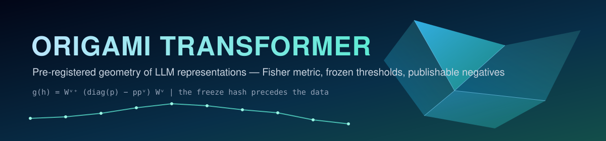

<p align="center">
  
</p>

<p align="center">
  
  
  
  
</p>

<p align="center"><em>How do transformer representations fold across layers — and what does that folding know?</em></p>

---

A research program on the **geometry of internal representations in transformer
language models**, run under a strict pre-registration discipline: **frozen
thresholds committed to git before any measurement**, honest negatives treated
as publishable results, and no retroactive exclusions — ever.

## Headline result — v5 (July 2026)

> **The per-layer Fisher-information geometry of a language model's hidden
> states carries a signature of *epistemic contestation*.** A contested claim
> and a consensual one are separable from that geometry alone (C1), the
> separation is not reducible to surface form (C2), and it collapses when
> linguistic structure is destroyed (C3).

**Global verdict: `HC_CONFIRMED` — 3/4 models, thresholds frozen before data
(commit [`ca588c3`](../../commit/ca588c38618325b2c54d0d78ab1c61baff379dc1)), no tolerance.**

| model | BA_geo | AUC_geo | AUC_surf | ΔAUC (C2) | BA_shuffled | ΔBA (C3) | B1 sanity | verdict |
|---|---|---|---|---|---|---|---|---|
| gpt2 | 0.729 | 0.792 | 0.645 | +0.147 | 0.512 | +0.217 | 0.342 ✓ | **CONFIRMED** |
| pythia-410m | 0.838 | 0.923 | 0.650 | +0.273 | 0.608 | +0.229 | 0.319 ✓ | **CONFIRMED** |
| opt-350m | 0.821 | 0.901 | 0.645 | +0.255 | 0.575 | +0.246 | 0.133 ✗ | **VOID** |
| bloom-560m | 0.908 | 0.955 | 0.644 | +0.311 | 0.633 | +0.275 | 0.471 ✓ | **CONFIRMED** |

The OPT run is **VOID, not a denial**: it passed every confirmation condition,
but the instrument's sanity baseline (the rank↔NLL coupling validated in v4)
failed on this model — so its confirmation was *not counted*. The gate worked
exactly as frozen. OPT is the only model with a structurally truncated lens
(`project_out`, rank ≤ 512); this is the leading v6 question.

Full numbers, caveats and limits: [`NOTE_RESULTATS_v5.md`](NOTE_RESULTATS_v5.md).
Corpus: 120 **expert-contested** claims (unsettled science, disputed empirical
findings — value judgments excluded) vs 120 consensual claims, exact
token-length matched, every contested line carrying **named affirming and
denying constituencies** ([`corpora/contested_anchors.tsv`](corpora/contested_anchors.tsv)).

## The discipline (why you can trust the table above)

1. **Literature first** — no probe is written before checking whether the
   question is already answered ([`STATE_OF_ART.md`](STATE_OF_ART.md)).
2. **Pre-registration before measurement** — hypothesis, observables, frozen
   falsification thresholds and verdict logic are committed *before* any script
   reads model output. The freeze commit hash is then stamped into the document:
   **the hash proves the thresholds preceded the data.**
3. **Negatives are results** — v3 (`H1_DÉMENTI`) and v4 (`HA_DÉMENTI`) are
   documented with the same care as the v5 confirmation
   ([`NOTE_RESULTATS_v1.md`](NOTE_RESULTATS_v1.md), [`NOTE_RESULTATS_v4.md`](NOTE_RESULTATS_v4.md)).

| campaign | instrument | hypothesis | verdict |
|---|---|---|---|
| v3 | NN intrinsic-dimension estimators (TwoNN/MLE) | layer-wise "bump" | `DENIED` — estimator failure mode found, estimators archived |
| v4 | **Fisher metric via logit-lens** (density-free) | bump, re-tested | `DENIED` 1/4 — but *final compression universal 4/4*, instrument validated |
| v5 | Fisher metric (frozen v4 protocol) | **H-C: geometry of contestation** | **`CONFIRMED` 3/4** |

The one robust motif across *all* instruments and campaigns: **final-layer
compression, 4/4 models, twice**.

## Reproduce

```bash
# corpus integrity is re-checked against the frozen sha256 at run time
run_v5_campaign.bat        # Windows: 16 runs (4 models x 2 arms x 2 modes) + verdict
# or run any single probe:
python probe_fisher.py --model gpt2 --corpus corpora/contested.txt --out results/gpt2_contested_fisher.json
python analysis_v5.py      # applies the frozen thresholds, refuses pilot outputs
```

CPU, float32, seed 0 (frozen). Full campaign ≈ 4 h 30 on a modern desktop CPU.
`--max-statements` outputs are flagged as pilots and **refused by the analysis**.

## Repo map

| File | Role |
|---|---|
| `PREREGISTRATION_v5.md` | the frozen contract (thresholds, verdict logic, corpus sha256) |
| `probe_fisher.py` | the instrument (frozen v4) — no verdicts, JSON out |
| `probe_fisher_shuffle.py` | content-destruction control (O3) |
| `analysis_v5.py` | frozen-threshold verdicts, integrity checks |
| `corpora/` | both arms + anchors + matching report (`README_corpora.md` = the corpus contract) |
| `RESEARCH_LOG.md` | the dated journal, including the failures |
| `CLAUDE.md` | the project contract any agent session must obey |
| `BOOTSTRAP.md` | the original kit this repo grew from |

## Roadmap (each step gets its own pre-registration)

1. **Within-domain contrast** — close the residual topic-vocabulary shortcut.
2. **The OPT anomaly** — LayerNorm-lens variant; does the rank-512 projection
   break the coupling, or the geometry?
3. **Scale** — larger / instruction-tuned models (GPU protocol, frozen from the start).

Sister projects: [lyra_reborn](https://github.com/SimonBouhier/lyra_reborn)
(cognitive OS — the confirmed v5 signal is a candidate *instrumented epistemic
tension* for its control loop) · EPP Verdict (epistemic attestation —
[docs](https://epp-verdict-docs.vercel.app)).

## License

Code and corpus: **MIT** (© 2026 Simon Bouhier). Third-party papers are linked,
never redistributed.
